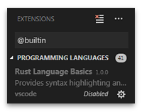

# vscode-language-rust

An alternative grammar definition set to support themes in providing syntax
highlighting for the [Rust][rust] programming language in [Visual Studio Code][vscode].

## Overview

The grammar provided by this extension is a direct port from [atom-language-rust][alr].

Please note the standard distribution of Visual Studio Code ships with a
built-in extension that provides Rust grammar definitions. It is recommended
that you disable it if you want to use this extension instead. This is to avoid
any strange behaviour that could arise from having multiple active extensions
contributing grammar definitions for the same language.

[alr]: https://github.com/miqid/atom-language-rust
[rust]: https://www.rust-lang.org/
[vscode]: https://code.visualstudio.com/